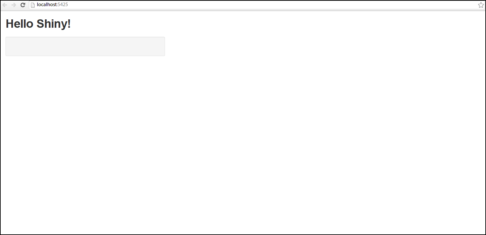

# Intro

-   `shiny` is an `R` package that enables web based applications
-   Overview of `shiny` basics
-   Three examples
-   The code/data necessary to reproduce anything in this talk is on [github](https://github.com/jwhendy/devFest-shiny)

---

# Basics

-   `shiny` works inside of [RStudio](http://www.rstudio.com/)
-   Two files are required to run an application
    -   `ui.R`: page format, user inputs, and outputs you're going to create
    -   `server.R`: contains the R code which will generate your dynamic output

Don't forget to run `install.packages("shiny")`!

---

# Minimal `ui.R`


```r
library(shiny)
# page format
shinyUI(pageWithSidebar(
  # title
  headerPanel("Hello Shiny!"),

  sidebarPanel(
    # user inputs go here
  ),

  mainPanel(
    plotOutput("plot") # what you're going to output, e.g. a plot
  )
))
```


---

# Minimal `server.R`


```r
library(shiny)

shinyServer(function(input, output) {
    
    # general R code here: load libraries, set variables/functions/etc.
    
    # output$name has to match ui.R's plotOutput('name')
    output$plot <- renderPlot({
        
        # code to make a plot goes here
        
    })
})
```


---

# It works!

-   After defining the above files&#x2026;


```r
# run from within R studio
library(shiny)
setwd("/path/to/ui-and-server.R")
```

```
## Error: cannot change working directory
```

```r
runApp()
```

```
## Error: Neither ui.R nor a www subdirectory was found in
## /media/vault/personal/presentations/devFest-shiny
```


<div class="center">

</div>

---

# Example: data analysis/exploration

-   Enable rapid and dynamic switching of plot variables
-   Allows for "plot prototyping" to examine trends/relationships
-   Web-based solution is easily sharable with others

---

# Fiddling with public transportation data

-   Grabbed data on public transportation centers around US (more [here](https://github.com/tcrug/public-transpo))
-   Some are quite efficient, some are horrible
-   Can `shiny` help find some interesting tidbits?

\pause

[**Demo time!**](http://jwhendy.shinyapps.io/transpo-exploration/)

---

# Example: interactive contour plots

-   Applied machine learning in `R` on product test data
-   Contour plots can be nice for visualizing effect of inputs vs. outputs
-   How to share the results with co-workers who don't use `R`?

\pause

[**Demo time!**](http://spark.rstudio.com/jwhendy/interactive-contour/)

---

# Example: visualizing insurance costs

-   Benefit plan choices are tough!
-   Started making visualizations/walkthroughs at 3M in 2011
-   Goal: simplify decision process through visualization

---

# The main issue

-   HR typically sends you a table like this on glossy paper; which plan is best?

<table border="2" cellspacing="0" cellpadding="6" rules="groups" frame="hsides">


<colgroup>
<col  class="left" />

<col  class="left" />

<col  class="left" />
</colgroup>
<thead>
<tr>
<th scope="col" class="left">&#xa0;</th>
<th scope="col" class="left">Plan A</th>
<th scope="col" class="left">Plan B</th>
</tr>
</thead>

<tbody>
<tr>
<td class="left">Premium</td>
<td class="left">$150/mo</td>
<td class="left">$250/mo</td>
</tr>


<tr>
<td class="left">3M Contribution</td>
<td class="left">$1,000</td>
<td class="left">$0</td>
</tr>


<tr>
<td class="left">Deductible</td>
<td class="left">$2,500</td>
<td class="left">$750</td>
</tr>


<tr>
<td class="left">\(OOP_{max}\)</td>
<td class="left">$5,000</td>
<td class="left">$4,000</td>
</tr>
</tbody>
</table>

---

# The main issue

-   These employees are not smiling because they understood the table

<div class="center">

</div>

Image credit: <http://jtsfs.com/employee-benefits-2/group-health-insurance/>

---

# In 2011, it was so simple!

<div class="center">
<./img/ins-intersections.pdf>
</div>

---

# Fast-foward to 2013

-   3M introduces split deductibles on two plans
-   Now which plan is best?

<table border="2" cellspacing="0" cellpadding="6" rules="groups" frame="hsides">


<colgroup>
<col  class="left" />

<col  class="left" />

<col  class="left" />

<col  class="left" />

<col  class="left" />

<col  class="left" />

<col  class="left" />
</colgroup>
<thead>
<tr>
<th scope="col" class="left">Plan</th>
<th scope="col" class="left">Premium</th>
<th scope="col" class="left">\(Ded_{ind}\)</th>
<th scope="col" class="left">\(Ded_{tot}\)</th>
<th scope="col" class="left">\(OOP_{ind}\)</th>
<th scope="col" class="left">\(OOP_{tot}\)</th>
<th scope="col" class="left">\(HSA\)</th>
</tr>
</thead>

<tbody>
<tr>
<td class="left">A</td>
<td class="left">$3,500</td>
<td class="left">$500</td>
<td class="left">$1,000</td>
<td class="left">$2,000</td>
<td class="left">$4,000</td>
<td class="left">-</td>
</tr>


<tr>
<td class="left">B</td>
<td class="left">$2,200</td>
<td class="left">-</td>
<td class="left">$2,750</td>
<td class="left">-</td>
<td class="left">$5,500</td>
<td class="left">$1,250</td>
</tr>


<tr>
<td class="left">C</td>
<td class="left">$600</td>
<td class="left">$2,750</td>
<td class="left">$5,500</td>
<td class="left">$5,500</td>
<td class="left">$11,000</td>
<td class="left">$1,250</td>
</tr>
</tbody>
</table>

---

# First shot

-   Now we need axes for max spender vs. everyone else&#x2026; contour plot!

<div class="center">
<./img/ins-contour.pdf>
</div>

---

# Winning cost map

-   "Stack" the contours, figure out which one is lowest

<div class="center">
<./img/ins-cost-map.pdf>
</div>

---

# So, what about *this* year?

-   I used `shiny`, obviously!
-   Dynamic UI elements for # of people on plan
-   ["Interesting" algorithm](http://stackoverflow.com/questions/18116967/dealing-with-conditionals-in-a-better-manner-than-deeply-nested-ifelse-blocks) for dealing with complex criteria
-   Hosted internally at 3M  with `shiny-server`
-   Put an anonymized version on [RStudio server](http://spark.rstudio.com/jwhendy/insurance-visualizer)

---

# Table of possible outcomes

<div class="center">
<table id="binary_conversion" border="2" cellspacing="0" cellpadding="6" rules="groups" frame="hsides">


<colgroup>
<col  class="right" />

<col  class="right" />

<col  class="right" />

<col  class="right" />

<col  class="right" />

<col  class="right" />

<col  class="right" />

<col  class="left" />
</colgroup>
<thead>
<tr>
<th scope="col" class="right">ded<sub>ind</sub></th>
<th scope="col" class="right">oop<sub>ind</sub></th>
<th scope="col" class="right">ded<sub>rem</sub></th>
<th scope="col" class="right">oop<sub>rem</sub></th>
<th scope="col" class="right">ded<sub>tot</sub></th>
<th scope="col" class="right">oop<sub>tot</sub></th>
<th scope="col" class="right">bin</th>
<th scope="col" class="left">formula</th>
</tr>
</thead>

<tbody>
<tr>
<td class="right">0</td>
<td class="right">0</td>
<td class="right">0</td>
<td class="right">0</td>
<td class="right">0</td>
<td class="right">0</td>
<td class="right">0</td>
<td class="left">exp<sub>ind</sub> + exp<sub>rem</sub></td>
</tr>


<tr>
<td class="right">1</td>
<td class="right">0</td>
<td class="right">0</td>
<td class="right">0</td>
<td class="right">0</td>
<td class="right">0</td>
<td class="right">1</td>
<td class="left">ded<sub>ind</sub> + 0.1 (exp<sub>ind</sub> - ded<sub>ind</sub>) + exp<sub>rem</sub></td>
</tr>


<tr>
<td class="right">0</td>
<td class="right">0</td>
<td class="right">1</td>
<td class="right">0</td>
<td class="right">0</td>
<td class="right">0</td>
<td class="right">4</td>
<td class="left">exp<sub>ind</sub> + exp<sub>rem</sub></td>
</tr>


<tr>
<td class="right">1</td>
<td class="right">0</td>
<td class="right">0</td>
<td class="right">0</td>
<td class="right">1</td>
<td class="right">0</td>
<td class="right">17</td>
<td class="left">ded<sub>ind</sub> + 0.1 (exp<sub>ind</sub> - ded<sub>ind</sub>) + exp<sub>rem</sub></td>
</tr>


<tr>
<td class="right">1</td>
<td class="right">1</td>
<td class="right">0</td>
<td class="right">0</td>
<td class="right">1</td>
<td class="right">0</td>
<td class="right">19</td>
<td class="left">oop<sub>ind</sub> + exp<sub>rem</sub></td>
</tr>


<tr>
<td class="right">0</td>
<td class="right">0</td>
<td class="right">1</td>
<td class="right">0</td>
<td class="right">1</td>
<td class="right">0</td>
<td class="right">20</td>
<td class="left">ded<sub>tot</sub> + 0.1 (exp<sub>ind</sub> + exp<sub>rem</sub> - ded<sub>tot</sub>)</td>
</tr>


<tr>
<td class="right">1</td>
<td class="right">0</td>
<td class="right">1</td>
<td class="right">0</td>
<td class="right">1</td>
<td class="right">0</td>
<td class="right">21</td>
<td class="left">ded<sub>tot</sub> + 0.1 (exp<sub>ind</sub> + exp<sub>rem</sub> - ded<sub>tot</sub>)</td>
</tr>


<tr>
<td class="right">1</td>
<td class="right">1</td>
<td class="right">1</td>
<td class="right">0</td>
<td class="right">1</td>
<td class="right">0</td>
<td class="right">23</td>
<td class="left">oop<sub>ind</sub> + ded<sub>ind</sub> + 0.1 (exp<sub>rem</sub> - ded<sub>ind</sub>)</td>
</tr>


<tr>
<td class="right">1</td>
<td class="right">0</td>
<td class="right">1</td>
<td class="right">1</td>
<td class="right">1</td>
<td class="right">0</td>
<td class="right">29</td>
<td class="left">ded<sub>tot</sub> + 0.1 (exp<sub>ind</sub> + exp<sub>rem</sub> - ded<sub>tot</sub>)</td>
</tr>


<tr>
<td class="right">1</td>
<td class="right">1</td>
<td class="right">0</td>
<td class="right">0</td>
<td class="right">1</td>
<td class="right">1</td>
<td class="right">51</td>
<td class="left">oop<sub>ind</sub> + exp<sub>rem</sub></td>
</tr>


<tr>
<td class="right">1</td>
<td class="right">1</td>
<td class="right">1</td>
<td class="right">0</td>
<td class="right">1</td>
<td class="right">1</td>
<td class="right">55</td>
<td class="left">oop<sub>ind</sub> + ded<sub>ind</sub> + 0.1 (exp<sub>rem</sub> - ded<sub>ind</sub>)</td>
</tr>


<tr>
<td class="right">1</td>
<td class="right">0</td>
<td class="right">1</td>
<td class="right">1</td>
<td class="right">1</td>
<td class="right">1</td>
<td class="right">61</td>
<td class="left">oop<sub>tot</sub></td>
</tr>


<tr>
<td class="right">1</td>
<td class="right">1</td>
<td class="right">1</td>
<td class="right">1</td>
<td class="right">1</td>
<td class="right">1</td>
<td class="right">63</td>
<td class="left">oop<sub>tot</sub></td>
</tr>
</tbody>
</table>
</div>

---

# Check against criteria; convert to binary

    test_case <- c(rep(c(exp_ind, exp_rem, exp_ind + exp_rem),   # vector of predicted costs
                       each = 2))                                # for max vs. others
    
    test_case <- rbind(test_case, test_case, test_case)          # three sets for three plans
    
    limits <- cbind(compare$ded_ind, compare$exp_max_ind,        # criteria values
                    compare$ded_ind, compare$exp_max_ind, 
                    compare$ded_tot, compare$exp_max_tot)
    
    result <- cbind(compare[, c("ded_ind", "ded_tot", "oop_ind", # store cutoffs in result
                                "oop_tot", "prem", "hsa")],
                    exp_ind, exp_rem,
                    (test_case > limits) %*% (2^(0:5)))          # convert T/F to binary

---

# Hacky function lookup

    map_funcs <- list(
      "0" = function(binary) { binary$exp_ind + binary$exp_rem }, 
      "1" = function(binary) { binary$ded_ind + (0.1* (binary$exp_ind - binary$ded_ind)) + binary$exp_rem }, 
      "4" = function(binary) { binary$exp_ind + binary$exp_rem }, 
      "16" = function(binary) { binary$ded_tot + (0.1 * (binary$exp_ind + binary$exp_rem - binary$ded_tot)) },
      "17" = function(binary) { binary$ded_ind + (0.1* (binary$exp_ind - binary$ded_ind)) + binary$exp_rem },
      "19" = function(binary) { binary$oop_ind + binary$exp_rem }, 
      "20" = function(binary) { binary$ded_tot + (0.1 * (binary$exp_ind + binary$exp_rem - binary$ded_tot)) }, 
      "21" = function(binary) { binary$ded_tot + (0.1 * (binary$exp_ind + binary$exp_rem - binary$ded_tot)) }, 
      "23" = function(binary) { binary$oop_ind + binary$ded_ind + (0.1 * (binary$exp_rem - binary$ded_ind)) },
      "28" = function(binary) { binary$ded_tot + (0.1 * (binary$exp_ind + binary$exp_rem - binary$ded_tot)) },
      "29" = function(binary) { binary$ded_tot + (0.1 * (binary$exp_ind + binary$exp_rem - binary$ded_tot)) },
      "48" = function(binary) { binary$oop_tot },   
      "51" = function(binary) { binary$oop_ind + binary$exp_rem }, 
      "55" = function(binary) { binary$oop_ind + binary$ded_ind + (0.1 * (binary$exp_rem - binary$ded_ind)) }, 
      "60" = function(binary) { binary$oop_tot }, 
      "61" = function(binary) { binary$oop_tot }, 
      "63" = function(binary) { binary$oop_tot }
    )

---

# 

\vfill

<div class="center">
'Nuff talk, let's take a [look](http://spark.rstudio.com/jwhendy/insurance-visualizer)!
</div>

\vfill

---

# Sharing `shiny` apps

-   Method 1: tar/zip all files, send, have user run locally
-   Method 2: install [shiny-server](http://www.rstudio.com/shiny/server/) on local machine

-   Method 3: request account for RStudio server account (still available?)
    -   Create/upload files; <http://spark.rstudio.com/uname/appName>

-   Method 4: request account on *new* RStudio server [here](http://www.shinyapps.io/signup.html)
    -   Create apps locally, then follow [shinyapps](https://github.com/rstudio/shinyapps/) instructions
    -   When satisfied, just run `deployApp()`!
    -   Visit app at <http://uname.shinyapps.io/appName/>

---

# References

-   [Getting started](http://www.rstudio.com/shiny/) with `shiny`
-   `shiny` [mailing list](https://groups.google.com/forum/#!forum/shiny-discuss)
-   RStudio server [application](https://shinyapps.io/)
-   [SO question](http://stackoverflow.com/questions/19130455/create-dynamic-number-of-input-elements-with-r-shiny) on creating dymanic input elements
-   [SO question](http://stackoverflow.com/questions/17683933/set-global-object-in-shiny) on global variables (not intuitive!)
-   [SO question](http://stackoverflow.com/questions/17838709/scale-and-size-of-plot-in-rstudio-shiny) on sizing plots in `shiny`
-   [SO question](http://stackoverflow.com/questions/17958730/faceting-a-set-of-contour-plots-in-ggplot-r) that solved my contour plot issue; repaid with `shiny` example

---

# Apps in this presentation

-   Transpo exploration: [spark.rstudio](http://spark.rstudio.com/jwhendy/transpo-exploration/) or [shinyapps.io](http://jwhendy.shinyapps.io/transpo-exploration)
-   [Interactive contour](http://spark.rstudio.com/jwhendy/interactive-contour/)
-   [Benefit analysis](http://spark.rstudio.com/jwhendy/insurance-visualizer/)
-   Everything's also on [github](https://github.com/jwhendy/devFest-shiny)!

---
